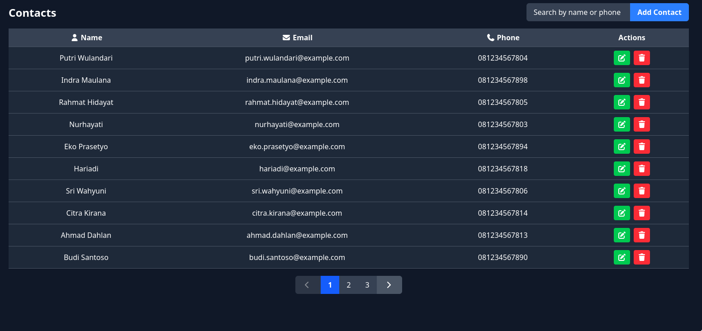

# Aplikasi Kontak



Aplikasi ini adalah contoh sederhana untuk mengelola daftar kontak. Backend dibangun menggunakan NestJS dan frontend dibangun menggunakan Angular.

Fitur-fitur:

- REST API
- Operasi CRUD
- Fungsi Search
- Fungsi Pagination
- Input validasi di frontend and backend

## Daftar Isi

- [Cara Menjalankan Aplikasi (Build)](#cara-menjalankan-aplikasi-build)
- [Daftar Endpoint API](#daftar-endpoint-api)
- [Cara Menjalankan Unit Test](#cara-menjalankan-unit-test)

## Cara Menjalankan Aplikasi (Build)

Pastikan Anda telah menginstal prasyarat berikut:

- Node.js (v18 atau lebih baru)
- pnpm
- Docker & Docker Compose
- make

Berikut adalah langkah-langkah untuk menjalankan keseluruhan aplikasi:

### 1. Database

Aplikasi ini menggunakan database MySQL 8.0 yang dijalankan melalui Docker. Semua konfigurasi dan manajemen container diatur melalui `makefile` dan `docker-compose.yml` yang ada di dalam folder `database`.

1.  **Masuk ke direktori database:**

    ```bash
    cd database
    ```

2.  **Menjalankan Database:**
    Gunakan perintah `make up` untuk membuat dan menjalankan container di background.

    ```bash
    make up
    ```

    Untuk mengelola container database, tersedia beberapa perintah `make`:

    - `make down`: Menghentikan dan menghapus container beserta jaringannya.
    - `make clean_restart`: Recreate docker dan remove volume lalu restart
      docker containernya
    - `make logs`: Melihat log dari database secara real-time.
    - `make mysql`: Terhubung langsung ke database MySQL melalui terminal.
    - `make stop`: Hanya menghentikan container tanpa menghapusnya.
    - `make start`: Menjalankan kembali container yang sudah dihentikan.
    - `make help`: Menampilkan semua perintah yang tersedia.

### 2. Backend

1.  **Masuk ke direktori backend:**

    ```bash
    cd backend
    ```

2.  **Instal dependensi:**

    ```bash
    pnpm install
    ```

3.  **Jalankan server development:**
    ```bash
    pnpm run start:dev
    ```
    Server akan berjalan di `http://localhost:3000`.

### 3. Frontend

1.  **Masuk ke direktori frontend:**

    ```bash
    cd frontend
    ```

2.  **Instal dependensi:**

    ```bash
    pnpm install
    ```

3.  **Jalankan aplikasi:**
    ```bash
    pnpm start
    ```
    Aplikasi akan berjalan di `http://localhost:4200`.

## Daftar Endpoint API

Berikut adalah daftar endpoint yang tersedia di backend. Semua endpoint memiliki prefix `/api/v1`.

| Metode HTTP | Path Endpoint         | Deskripsi                                                          |
| ----------- | --------------------- | ------------------------------------------------------------------ |
| `GET`       | `/contacts`           | Mengambil semua kontak. Mendukung query `?query=` untuk pencarian. |
| `GET`       | `/contacts/paginated` | Mengambil kontak dengan sistem paginasi berbasis kursor.           |
| `GET`       | `/contacts/count`     | Mendapatkan jumlah total kontak.                                   |
| `GET`       | `/contacts/:uuid`     | Mengambil satu kontak berdasarkan ID (UUID).                       |
| `POST`      | `/contacts`           | Membuat satu kontak baru.                                          |
| `POST`      | `/contacts/bulk`      | Membuat beberapa kontak sekaligus (bulk).                          |
| `PATCH`     | `/contacts/:uuid`     | Memperbarui data kontak berdasarkan ID.                            |
| `DELETE`    | `/contacts/:uuid`     | Menghapus kontak berdasarkan ID.                                   |
| `GET`       | `/health`             | Endpoint untuk memeriksa status kesehatan server.                  |

## Cara Menjalankan Unit Test

### Backend

1.  **Masuk ke direktori backend:**
    ```bash
    cd backend
    ```
2.  **Jalankan perintah test:**
    ```bash
    pnpm test
    ```
